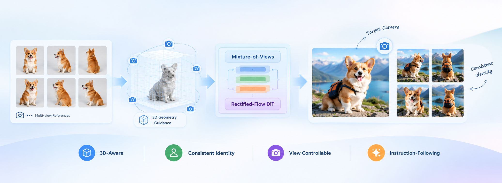

# ViewWeaver

ViewWeaver is a geometry-grounded generative rendering framework for **3D-aware image customization**. Given multi-view references, a target camera, and a text instruction, it generates customized subject images while preserving subject identity and 3D structure across viewpoints and scenes.

[Paper](assets/viewweaver.pdf) · [Model Weights](https://huggingface.co/Yw22/ViewWeaver) · [Inference Guide](docs/inference.md) · [Data Formats](docs/data.md)

<p align="center">
  
</p>

## Installation

Use a CUDA GPU with bfloat16 support. The commands below create a dedicated environment with PyTorch for CUDA 12.8; choose a matching PyTorch build for other CUDA versions.

```bash
conda create -n viewweaver python=3.12 -y
conda activate viewweaver

python -m pip install torch==2.8.0 torchvision==0.23.0 \
  --index-url https://download.pytorch.org/whl/cu128

cd /path/to/ViewWeaver
python -m pip install -e '.[prepare]' \
  'numpy==1.26.4' 'opencv-python==4.11.0.86'
export PYTHON="$(command -v python)"
```

Dependencies are defined in `pyproject.toml`; the `prepare` extra installs VGGT. `PYTHON` selects the active environment for the Bash launchers.

## Model Weights

Obtain access to [FLUX.1-Kontext-dev](https://huggingface.co/black-forest-labs/FLUX.1-Kontext-dev) and accept its terms before downloading:

```bash
hf auth login
hf download Yw22/ViewWeaver --local-dir checkpoints/viewweaver
hf download facebook/VGGT-1B --local-dir checkpoints/vggt
hf download black-forest-labs/FLUX.1-Kontext-dev --local-dir checkpoints/flux-kontext
```

Use the complete FLUX.1-Kontext-dev Diffusers checkpoint. See [checkpoint layout](docs/data.md#checkpoint-layout) for the expected files.

## Quick Start

Each run processes **one case** and generates one target view by default. The included Mario and backpack examples each contain **eight reference images and foreground masks**. Mario uses an impressionist oil-painting scene; backpack uses a mossy forest scene. Choose either workflow below and run from the project root.

### Option 1: Direct inference

Run VGGT preparation and image generation in one command:

```bash
# Mario: impressionist oil painting
CUDA_VISIBLE_DEVICES=0 bash scripts/run_case.sh --case examples/mario \
  --reference-view 0 --azimuth -15 --elevation 15 \
  --camera-distance 4.5 --offset-y 0.18 --save-comparison

# Backpack: mossy tree roots in a misty forest
CUDA_VISIBLE_DEVICES=0 bash scripts/run_case.sh --case examples/backpack \
  --reference-view 0 --azimuth -15 --elevation 10 \
  --camera-distance 4.5 --offset-y 0.18 --save-comparison
```

The Mario command uses the defaults, so `CUDA_VISIBLE_DEVICES=0 bash scripts/run_case.sh --case examples/mario` is equivalent. The backpack example overrides the target angles.

### Option 2: Prepare once, generate repeatedly

Extract reference features and geometry, then reuse the cache for generation:

```bash
# Mario: impressionist oil painting
CUDA_VISIBLE_DEVICES=0 PREPARED_DIR=outputs/prepared_8views bash scripts/prepare_case.sh --case examples/mario

CUDA_VISIBLE_DEVICES=0 bash scripts/run_prepared.sh --case outputs/prepared_8views/mario \
  --reference-view 0 --azimuth -15 --elevation 15 \
  --camera-distance 4.5 --offset-y 0.18 --save-comparison

# Backpack: mossy tree roots in a misty forest
CUDA_VISIBLE_DEVICES=0 PREPARED_DIR=outputs/prepared_8views bash scripts/prepare_case.sh --case examples/backpack

CUDA_VISIBLE_DEVICES=0 bash scripts/run_prepared.sh --case outputs/prepared_8views/backpack \
  --reference-view 0 --azimuth -15 --elevation 10 \
  --camera-distance 4.5 --offset-y 0.18 --save-comparison
```

The commands above create new eight-view caches under `outputs/prepared_8views`; older five-view caches cannot be used with the default input count. Run preparation once per case, then rerun only `run_prepared.sh` to change target angles or prompts. If reference images or masks change, prepare a new cache using a different `PREPARED_DIR`; existing caches are not overwritten.

### Parameters and outputs

Defaults: **8 input views**, **reference view 0**, **azimuth −15°**, **elevation 15°**, **camera distance 4.5**, and **vertical offset 0.18**. Override any setting with its CLI argument. `--reference-view` selects the reference view used as the target-angle coordinate frame; `CUDA_VISIBLE_DEVICES` selects the GPU.

Outputs are saved to `outputs/<case>/<timestamp>/`: target images, reference–target comparisons, and `result.json`. Generation defaults to **1024 × 1024**, **32 steps**, and **guidance scale 3.5**. Use `--no-save-comparison` to disable comparison images.

See the [inference guide](docs/inference.md) for camera controls, optional [two-stage inference](docs/inference.md#two-stage-inference), and environment checks. See [data formats](docs/data.md) to use your own images and masks.

## Acknowledgments

Built on [VGGT](https://github.com/facebookresearch/vggt), [FLUX.1-Kontext-dev](https://huggingface.co/black-forest-labs/FLUX.1-Kontext-dev), and [Diffusers](https://github.com/huggingface/diffusers). Their applicable licenses and terms, along with those of the example assets, continue to apply.

## Citation

```bibtex
@inproceedings{li2026viewweaver,
  title={ViewWeaver: Geometry-Grounded Generative Rendering for 3D-Aware Image Customization},
  author={Li, Yaowei and Li, Xiaoyu and Zhang, Zhaoyang and Li, Hongxiang and Chen, Long and Shan, Ying and Zou, Yuexian},
  booktitle={Proceedings of the Special Interest Group on Computer Graphics and Interactive Techniques Conference Conference Papers},
  pages={1--12},
  year={2026}
}
```
